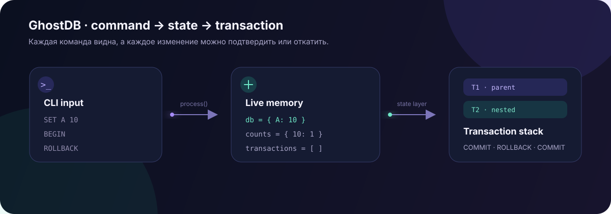

# 🧠 GhostDB

> A tiny in-memory database built to make transactions visible.

GhostDB is an educational Python CLI project with SQL-like commands such as `SET`, `GET`, `FIND`, and `COUNTS`, plus support for nested transactions. Data lives only in the process memory: start a session, experiment, and exit.

<p align="center">
  <a href="./docs/"><strong>▶ Open the interactive Playground</strong></a>
  ·
  <a href="https://github.com/GLec1er/GhostDB">View the GitHub repository</a>
</p>

<p align="center">
  
</p>

## What makes it interesting

| Capability | What it demonstrates |
| --- | --- |
| `SET / GET / UNSET` | Basic key-value operations |
| `FIND / COUNTS` | Finding keys by value and counting matches |
| `BEGIN / ROLLBACK / COMMIT` | Isolated changes and state recovery |
| Nested transactions | Merging a child layer into its parent |
| `--script` and `--debug` | Reproducible scenarios and visible internal operations |

## Quick start

```bash
git clone https://github.com/GLec1er/GhostDB.git
cd GhostDB
python cli.py --interactive
```

Try this scenario in the CLI:

```text
SET mode demo
BEGIN
SET mode transaction
GET mode
ROLLBACK
GET mode
END
```

Expected output from the two `GET` commands:

```text
transaction
demo
```

Run the included script file with:

```bash
python cli.py --script tests.txt
python cli.py --script tests.txt --debug
```

## Commands

| Command | Format | Result |
| --- | --- | --- |
| `SET` | `SET <key> <value>` | Stores a value |
| `GET` | `GET <key>` | Returns a value or `NULL` |
| `UNSET` | `UNSET <key>` | Removes a key |
| `COUNTS` | `COUNTS <value>` | Counts keys with a matching value |
| `FIND` | `FIND <value>` | Lists keys with a matching value |
| `BEGIN` | `BEGIN` | Opens a transaction layer |
| `ROLLBACK` | `ROLLBACK` | Reverts the current layer |
| `COMMIT` | `COMMIT` | Applies a layer or merges it into its parent |
| `END` | `END` | Ends the interactive session |

### How rollback works

GhostDB stores the original value of a key in the active transaction layer the first time that key changes. The sequence can therefore be read as a history of layers:

```text
BEGIN          open layer T1
SET A 10       save A's previous value in T1
BEGIN          open nested layer T2
SET A 20       save A's previous value in T2
ROLLBACK       restore A to 10 and close T2
COMMIT         confirm T1
```

## Interactive documentation

In the [GhostDB Playground](./docs/) you can:

- enter commands and see the result immediately;
- watch the key table, value counters, and transaction stack;
- load a demo scenario;
- explore the project architecture without installing Python.

This is a standalone browser visualization of the CLI behavior. The source implementation remains in [`cli.py`](./cli.py).

### Enable GitHub Pages

In the repository settings, open `Settings → Pages`, choose `Deploy from a branch`, select the `main` branch and `/docs` folder, then click `Save`. Once published, the page will be available at `https://glec1er.github.io/GhostDB/`.

## Checks

```bash
python -m pytest -q
```

## Project structure

```text
.
├── cli.py              # CLI and GhostDB implementation
├── main.py             # minimal runner
├── tests/test_cli.py   # CLI scenario test
├── tests.txt           # reproducible command script
├── output.txt          # expected output
└── docs/               # interactive GitHub Pages showcase
    ├── index.html
    └── ghostdb-flow.svg
```

## Author

**[GLec1er](https://github.com/GLec1er)** · built with soul ❤️
